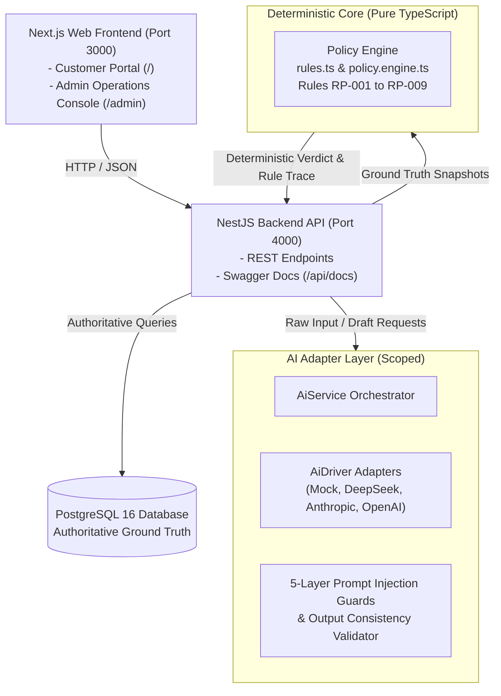
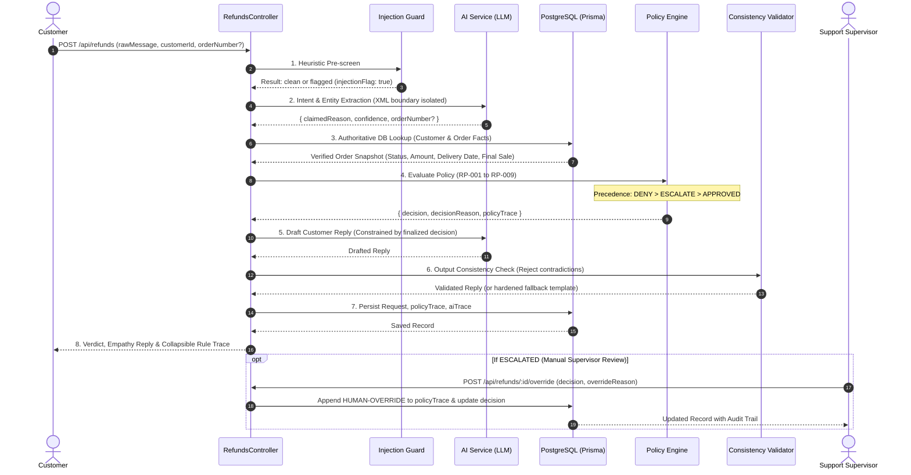

# Worknoon Refund System — System Architecture & Request Lifecycle

## 1. Architectural Philosophy

The core thesis of the Worknoon Refund System is:
> **The LLM classifies intent and writes the explanation. A deterministic, unit-tested policy engine makes the decision. Ground truth always comes from the database, never from the customer's message.**

Money is never authorized by probabilistic language models. Instead:
- **Language Layer (Scoped LLM):** Extracts customer intent, flags prompt manipulations, and drafts empathetic responses conditioned strictly on finalized decisions.
- **Decision Layer (Deterministic Pure TypeScript):** Evaluates authoritative database facts against published business rules (`RP-001` through `RP-009`) with resolution precedence: **`DENY` > `ESCALATE` > `APPROVED`**.
- **Data Layer (PostgreSQL 16 + Prisma):** Serves as the sole authoritative source of truth for order amounts, delivery timestamps, return windows, item types, and customer risk flags.

---

## 2. Component Diagram

---

## 3. End-to-End 9-Stage Request Lifecycle

When a customer submits a refund claim via `POST /api/refunds`:

---

## 4. Architectural Separation of Concerns

The repository structure reinforces the separation between policy and AI:
- `api/src/policy/`: Has **zero dependencies** on external packages, AI services, network, or databases. Takes pure snapshots and returns deterministic verdicts.
- `api/src/ai/`: Handles language tasks only. Outputs typed Zod schemas. Has no ability to change policy rules or write to financial records.
- `api/src/modules/refunds/`: Orchestrates the pipeline, passing verified database facts into the policy engine and logging both `policyTrace` and `aiTrace` independently.
